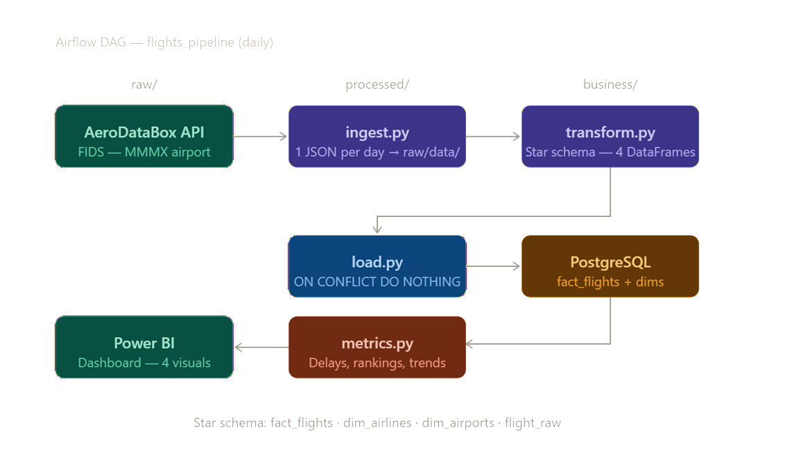
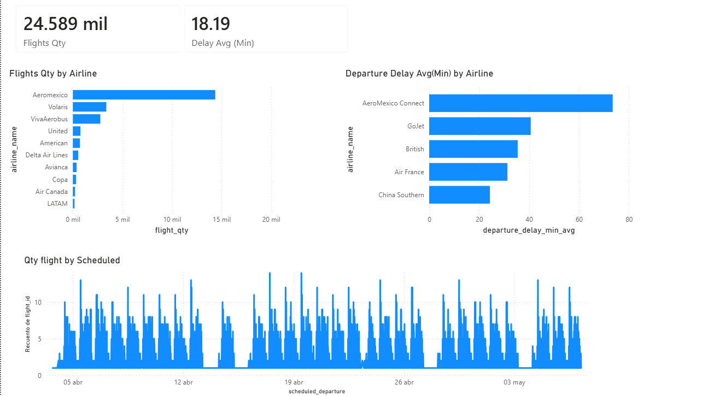

# ✈️ Flights Pipeline

End-to-end data pipeline that ingests daily flight data from Mexico City's 
international airport (AICM/MMMX) using the AeroDataBox API, transforms it 
into a star schema, and loads it into PostgreSQL. Orchestrated with Apache Airflow.

---

## Architecture



The pipeline runs in three layers:

- `raw/` — calls the AeroDataBox API and stores one JSON file per day
- `processed/` — transforms raw JSON into a star schema and loads into PostgreSQL
- `business/` — queries metrics and feeds the Power BI dashboard

---

## Star Schema

| Table | Description |
|---|---|
| `fact_flights` | Flight events — departures, arrivals, delays, status |
| `dim_airlines` | Airline catalog |
| `dim_airports` | Airport catalog |
| `flight_raw` | Raw API response stored as JSONB |

---

## Dashboard



- Total flights processed
- Average departure delay (minutes)
- Top 10 airlines by flight volume
- Top 5 airlines by average delay
- Flights per day (time series)

---

## Stack

| Tool | Purpose |
|---|---|
| Python 3.12 | Ingestion and transformation |
| pandas | Data processing |
| PostgreSQL | Data warehouse |
| psycopg2 | Python → PostgreSQL connection |
| Apache Airflow 2.9 | Pipeline orchestration |
| AeroDataBox API | Data source via RapidAPI |
| Power BI | Dashboard and reporting |

---

## Airflow DAG

The `flights_pipeline` DAG runs daily with two sequential tasks:
download_data → load_data
- `download_data` — fetches flights for the DAG's logical date (`ds`, i.e. the day that just completed) from AeroDataBox and saves JSON to `raw/data/`
- `load_data` — transforms and loads into PostgreSQL using `ON CONFLICT DO NOTHING` for idempotency

---

## Local Setup

```bash
git clone https://github.com/orlandomtz77/flights-pipeline.git
cd flights-pipeline
python -m venv .venv
.venv\Scripts\activate
pip install -r requirements.txt
```

Create a `.env` file in the project root:
APIKEY=your_api_key
DB_HOST=localhost
DB_PORT=5432
DB_NAME=flight_db
DB_USER=postgres
DB_PASSWORD=your_password
Then run:

```bash
python processed/db_setup.py   # create tables
python raw/ingest.py           # download yesterday's data
python processed/load.py       # transform and load
```

`raw/ingest.py` downloads yesterday by default. For a specific day or a historical backfill:

```bash
python raw/ingest.py --date 2026-06-15                  # single day
python raw/ingest.py --start 2026-04-04 --end 2026-05-07 # date range
```

---

## Known Limitations

- AeroDataBox free plan: ~600 units/month (~300 TIER 2 calls)
- `airport_name` not available in the FIDS endpoint — field is empty in `dim_airports`
- PostgreSQL host IP from WSL2 may change on restart — update `DB_HOST` in `.env`

---

## Author

Orlando Martínez — [@orlandomtz77](https://github.com/orlandomtz77)